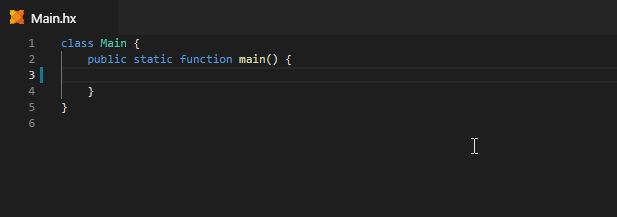
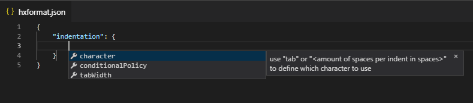

# Haxe Formatter

[](http://lib.haxe.org/p/formatter)
[](https://travis-ci.org/HaxeCheckstyle/haxe-formatter)
[](https://codecov.io/gh/HaxeCheckstyle/haxe-formatter)

A Haxe Code Formatter based on the [tokentree](https://github.com/HaxeCheckstyle/tokentree) library.



**It's recommended to make a backup of your files and use a diff tool.**

## Features

- Formatting handles:
  - Indentation
  - Whitespace
  - Wrapping
  - Empty Lines
  - Same Line
  - Line Ends
- `hxformat.json` configuration files
- supports latest Haxe 4 syntax
- supports conditional compilation
- [Visual Studio Code Integration](https://github.com/vshaxe/vshaxe/wiki/Formatting)

## Usage

Apart from IDE integration, there's also a command line version of haxe-formatter that can be installed from haxelib:

```bash
haxelib install formatter
```

### Bulk Formatting

- Run `haxelib run formatter -s src` to format folder `src`.
- Run `haxelib run formatter -s src -s test` to format folders `src` and `test`.

If the `node` command is available on your system, the formatter automatically uses a JS instead of a Neko build (which is considerably faster).

### Single File Formatting

Run `haxelib run formatter -s src/Main.hx` to format file `src/Main.hx`.

### Format check

Use `--check` to run formatter in check mode to see if code is properly formatted without modifying it. This can be especially useful in a CI environment.

## Configuration

Formatter uses `hxformat.json` files for configuration. It searches for a `hxformat.json` file closest to the file being formatted, starting with the file's folder and moving upward all the way to your root folder. A configuration file in a subfolder will always overwrite any settings from a top or higher level folder.

The VSCode extension comes with a JSON schema providing completion and limited documentation for edition `hxformat.json` files:



An empty `hxformat.json` (containing only `{}`) or having `hxformat.json` will result in formatting using the built-in default which is the coding style of formatter itself.

When creating your custom `hxformat.json` file, you only need to provide settings that you want to override with respect to the built-in default. So configuration always starts with the default style of formatter.

### Ways to opt-out of formatting

- turn off formatter in your IDE / don't run CLI version
  - affects all files
- place a `hxformat.json` file with `{ "disableFormatting": true }` in you workspace
  - affects all files and subfolders from where you placed `hxformat.json`
  - since formatter searches for a `hxformat.json` file closest to the file being formatted, you can `disableFormatting` in a subfolder, while enabling it everywhere else
  - you can reverse a `disableFormatting` by placing a `hxformat.json` with `{}` (for built-in formatter config) in a subfolder, every file in that subfolder and below will get formatted
- use `excludes` inside your `hxformat.json` to specify a number of regexes, that will exclude any filename from formatting matching any one of these regexes
- use `// @formatter:off` and `// @formatter:on` comments inside your code to turn off formatting for parts of your code, it's line based and includes lines containing `// @formatter:off` and `// @formatter:on`.

## Todo

- improve wrapping

## Development

### Unittests

To run all unittests simply use `haxe buildTest.hxml`

if you want to only run a single testcase you can either:

- use `vshaxe-debug-tools` extension in VSCode which provides a `Run current formatter test` command that runs on any `.hxtest` file
- run it on command line by
  1. place a file called `single-run.txt` in your workspace's `test` folder
  2. make `single-run.txt` contain your testcase's path and name (without `.hxtest` extension) like `test/testcases/sameline/issue_235_keep_if_else`
  3. run `haxe buildTest.hxml`
  4. you will get a `test/formatter-result.txt` containing two sections with result and gold (empty sections for green tests)

Removing `test/single-run.txt` makes `haxe buildTest.hxml` do a full run. `vshaxe-debug-tools` is recommended since it performs all manual steps outlined and also opens a diff-view editor so you can easily compare result and gold.
